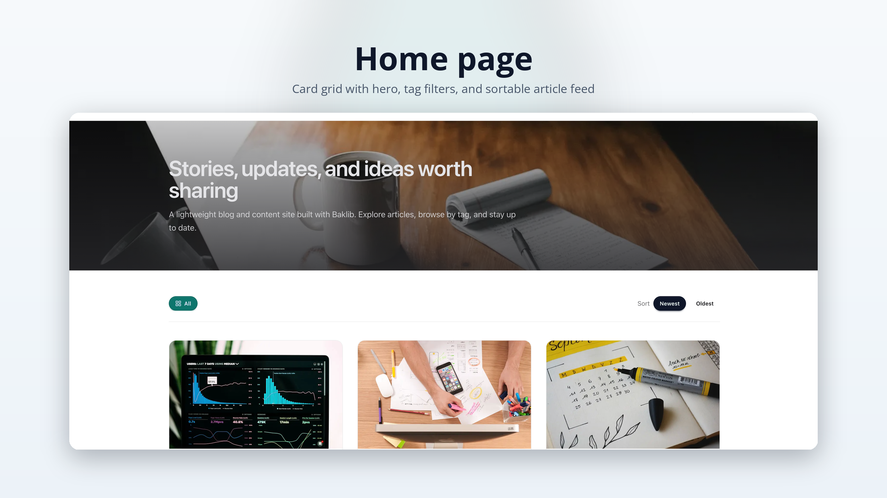
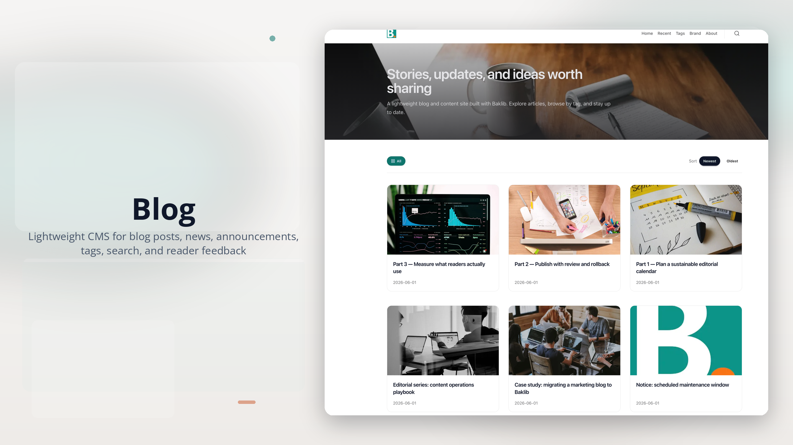
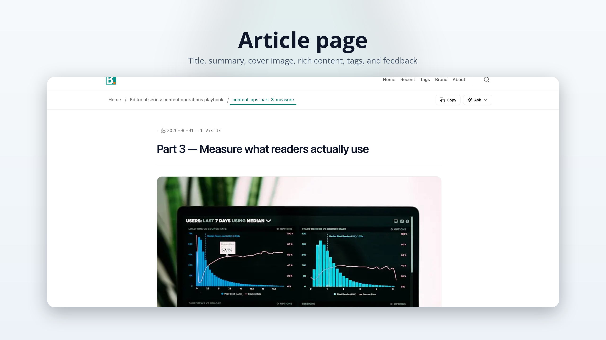
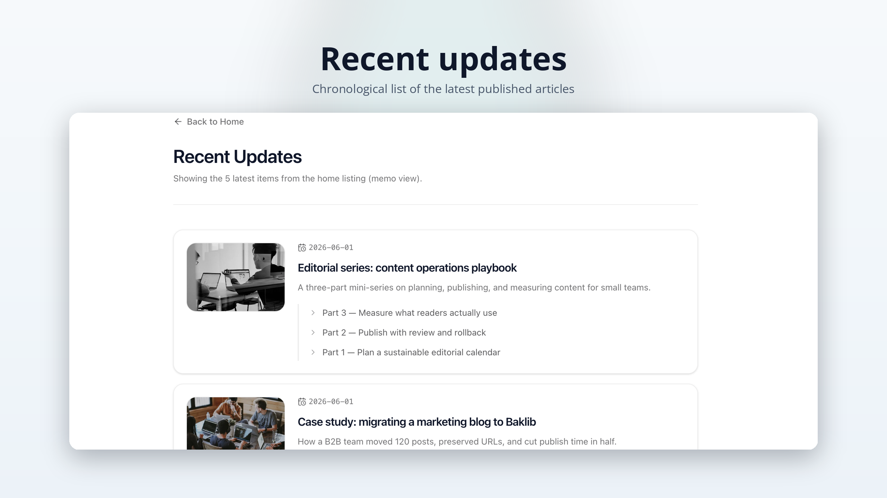
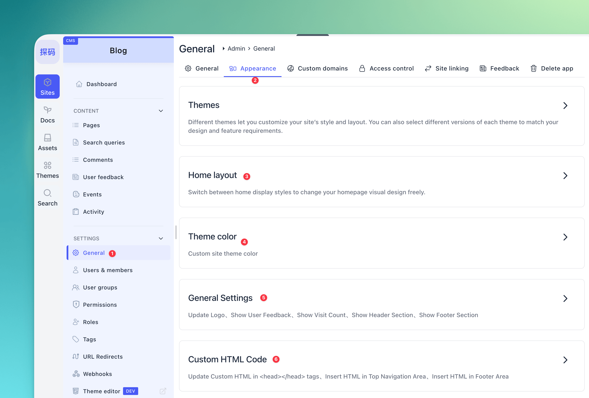
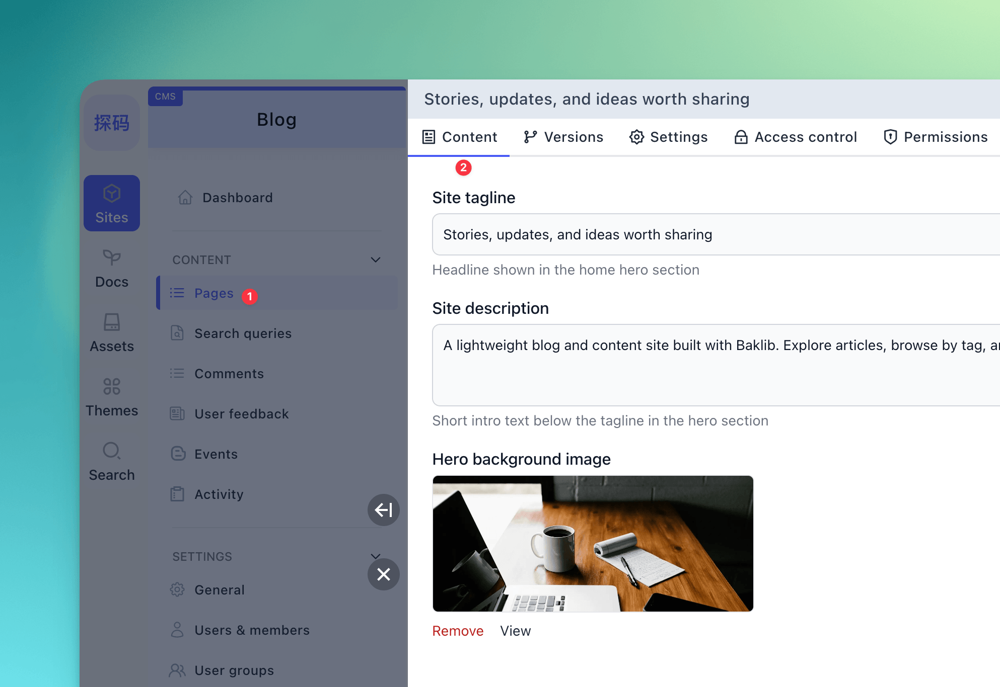

# Baklib CMS — 博客主题（简体中文说明）

面向 Baklib 站点的轻量 **博客 / 新闻 / 公告** 主题：提供两种首页（卡片网格与列表）、带标签与可选反馈的文章页、搜索与标签列表页，样式基于 Tailwind CSS。

模板 git 地址：https://github.com/baklib-templates/blog

---

## 功能概览

目录结构

| 路径                          | 说明                                                  |
| ----------------------------- | ----------------------------------------------------- |
| `templates/`                  | 页面模板                                              |
| `snippets/`                   | 可复用片段                                            |
| `layout/`                     | 全站布局 `theme.liquid`                               |
| `config/settings_schema.json` | 主题设置定义                                          |
| `locales/`                    | 前台文案（`*.json`）与 schema 翻译（`*.schema.json`） |
| `seeds/`                      | 示例站点与页面（**默认英文**）                        |
| `assets/`                     | 构建后的 CSS/JS                                       |
| `src/`                        | 样式与 JS 源码                                        |

---

- **首页**：卡片网格（`templates/index.liquid`）或列表（`templates/index.list.liquid`），含标签导航；卡片首页支持按发布时间排序。
- **文章页**（`templates/page.liquid`）：标题、摘要、封面、富文本正文、标签、版本链接，可选访问量与用户反馈。
- **搜索**（`templates/search.liquid`）、**标签列表**（`templates/tag.liquid`）。
- 主题选项见 `config/settings_schema.json`；前台文案见 `locales/*.json`；后台编辑器字段标签见 `locales/*.schema.json`。

---

## 效果预览

|               首页 (卡片式)                |                 封面 (缩略图)                  |
| :----------------------------------------: | :--------------------------------------------: |
|   |       |
|                 **文章页**                 |                 **最近更新页**                 |
|  |  |

---

## 安装教程

在 Baklib 模板市场中找到【Blog】，点击安装，即可完成。

|                   1. 选择并安装主题                    |                     2. 站点基本设置                     |                    3. 首页与模板配置                     |
| :----------------------------------------------------: | :-----------------------------------------------------: | :------------------------------------------------------: |
|  |  |  |

---

## 其它文档

- 英文总览：[README.md](./README.md)
- 主题帮助：[www.baklib.com/themes](https://www.baklib.com/themes/blog)
